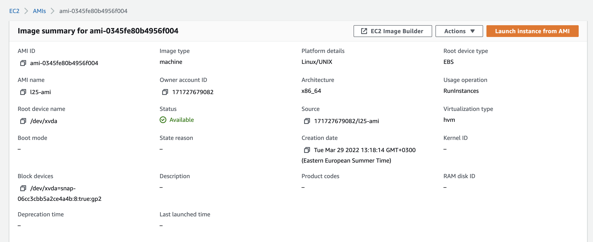
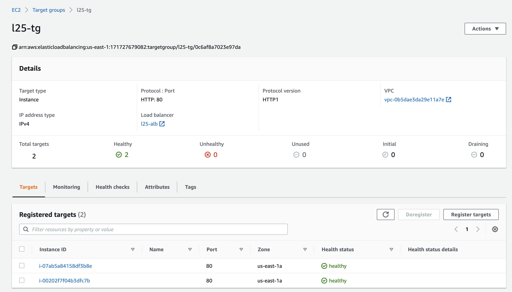
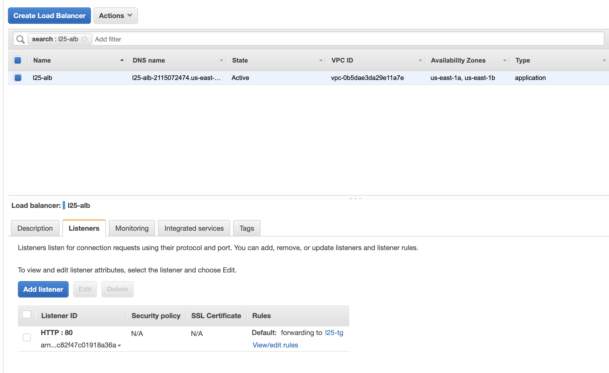
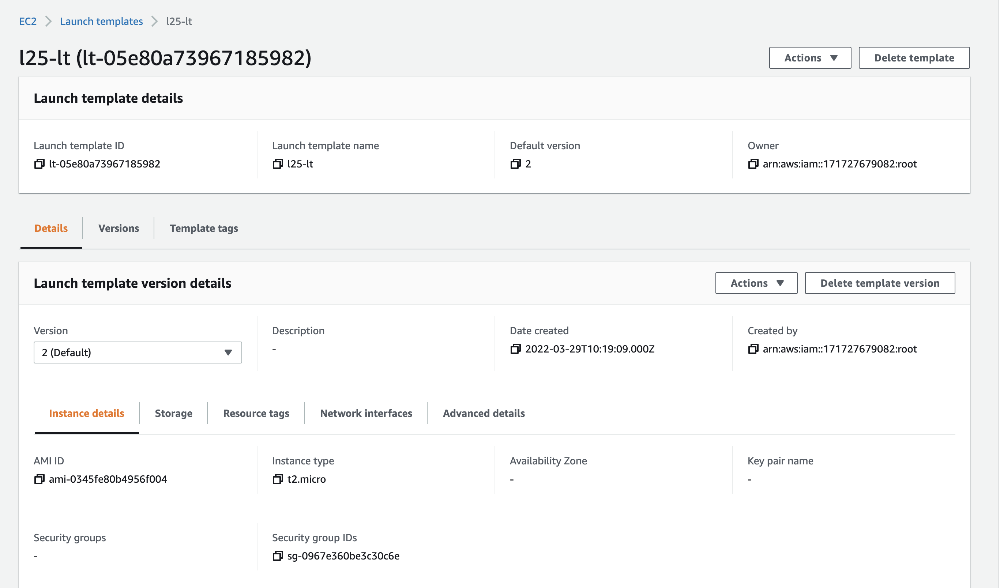
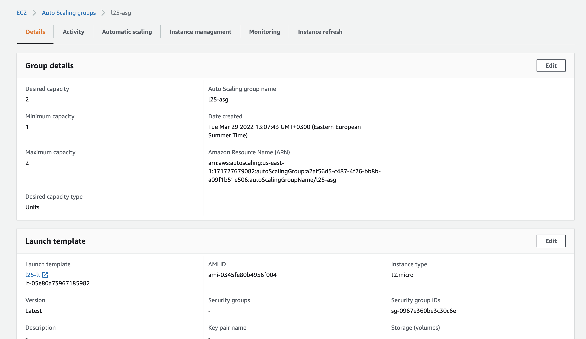
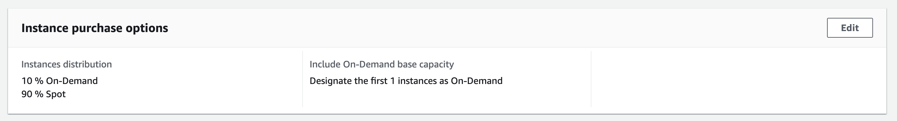
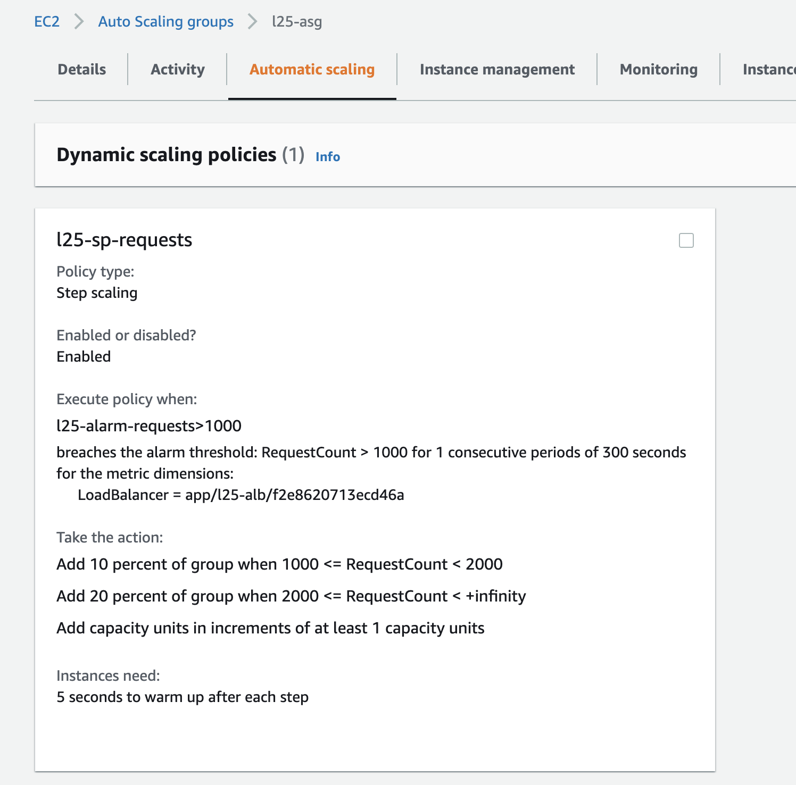
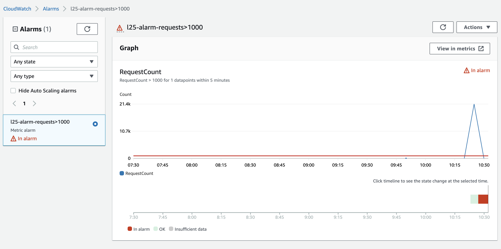
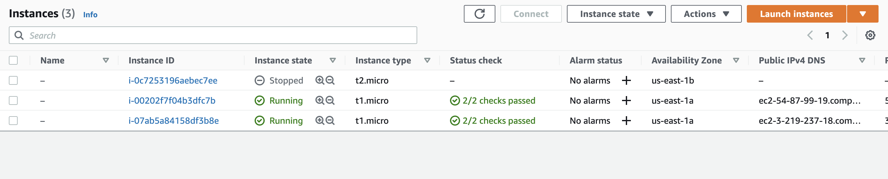
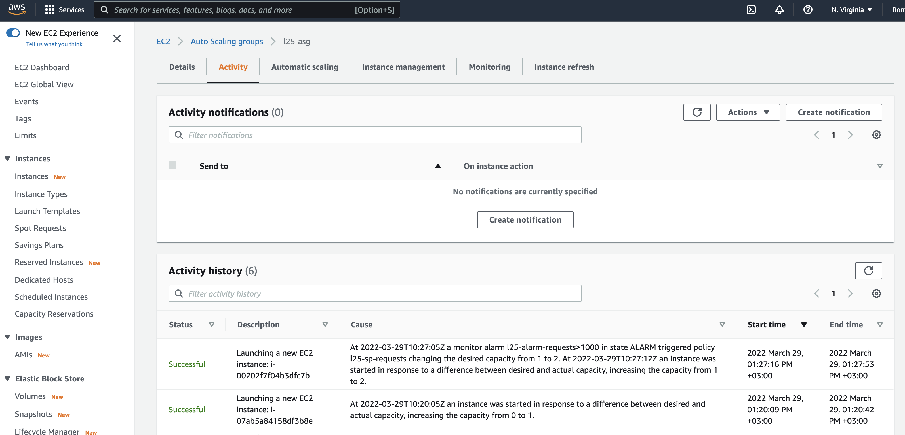

### Pre requisits 

- AWS account

## Autoscale group task 

According to the [guide](https://docs.aws.amazon.com/autoscaling/ec2/userguide/as-register-lbs-with-asg.html), 
there should be an AMI which you will use in the next steps. 

Create AMI with simple nginx app (previous homework)

Then set up a Target Group 

and Load Balancer. Pay attantion that Target Group has to be linked with
Load Balancer.

Create Launch Template

Create Autoscale Group.

Pay attention to configure Spot instances usage

and configure scaling policies

## Results

Let's test it via siege. 

`siege -c100 -t60s l25-alb-2115072474.us-east-1.elb.amazonaws.com`

As a result, we can see that system detected unusual traffic

Autoscale Group created new instance

and update its activity history too.

