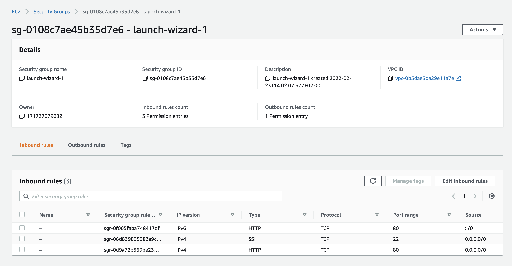
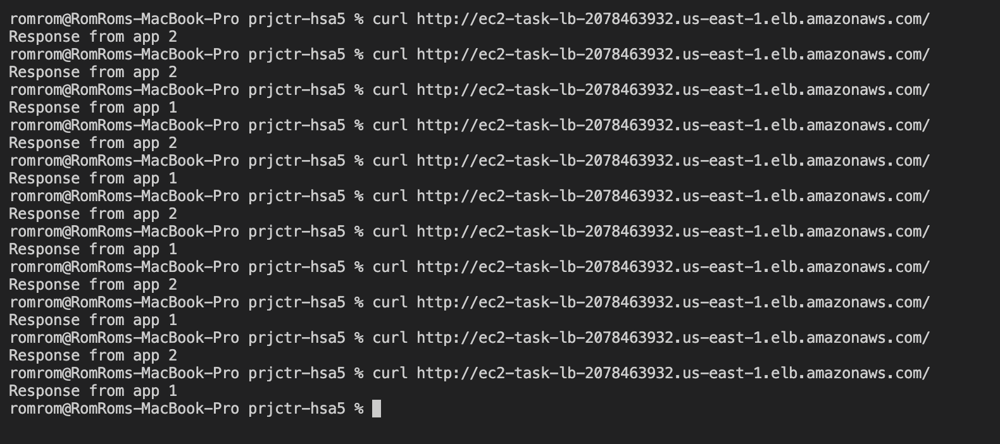

# Start working

### Pre requisits 

- AWS account

## Create EC2 isntances with security group

1. create two 't2.micro' instances in the same security group
2. add 'http' inbound rule to the group.

3. install nginx on each: 
```
sudo amazon-linux-extras list | grep nginx
sudo amazon-linux-extras enable nginx1
sudo yum clean metadata
sudo yum install nginx
sudo service nginx start
```
4. change `/usr/share/nginx/html/index.html` file to differentiate instances. 
For example, "Response from app 1" and "Response from app 2"

## Create Load balancer

Just follow the instructions, select instances you need, specify correct ports 
and end-points for heath check. Done.

## Result 


