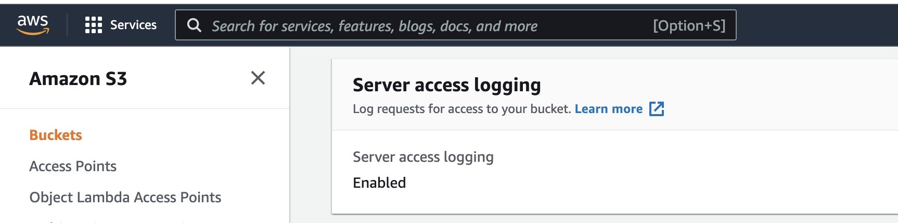
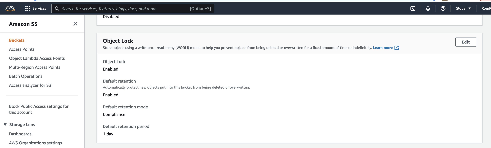
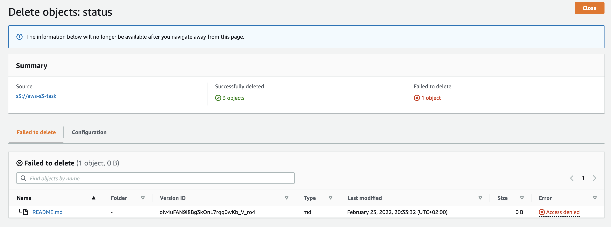
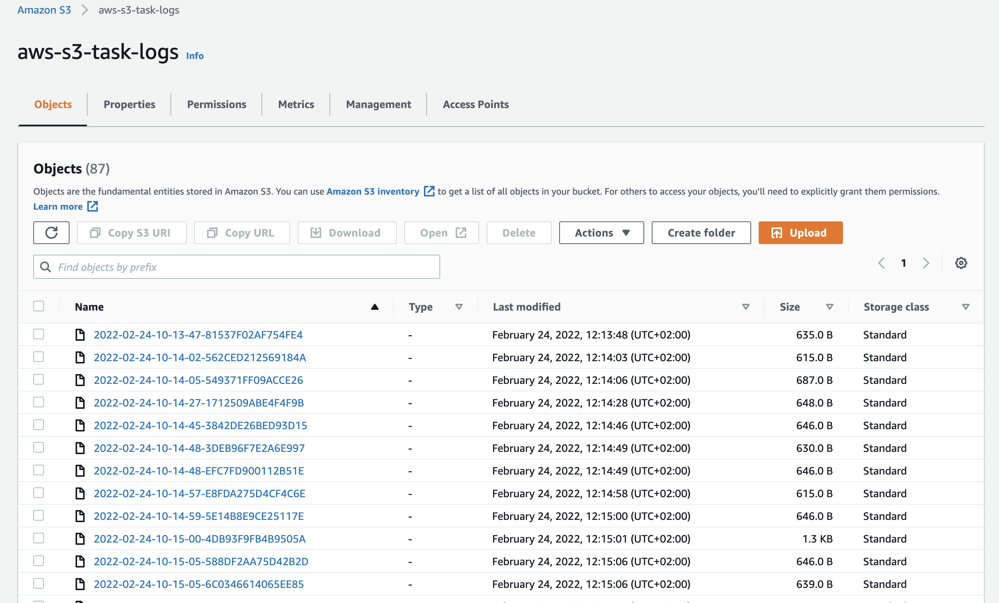

# Start working

### Pre requisits 

- AWS account

## Create bucket 

1. Create S3 bucket with default configuration.
2. Enable access logging (seems you cannot use 
the same bucket to store logs)

3. Enable WORM strategy via Object Lock property

## Result 

Try to upload a file and then delete it

Access logs:

