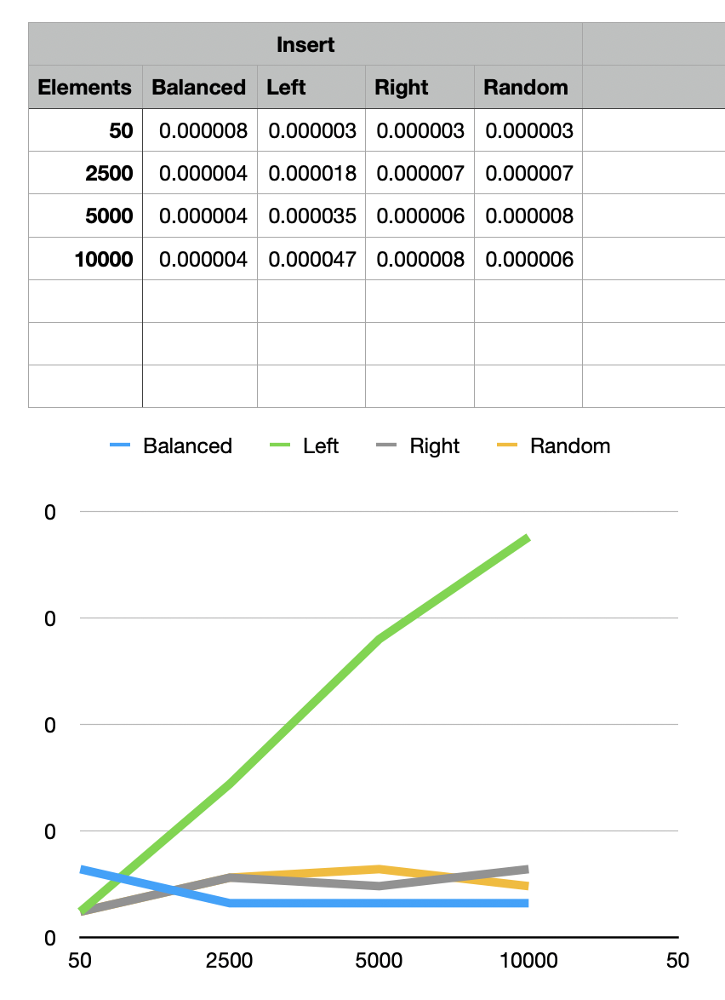

### Pre requisits 

1. installed JDK (optional)

## Binary Search Tree test

There are two classes in the `app/../bst` project. First one implements Binary Search 
Tree and basic operations, such as Insert, Search and Delete. 
Second class provides simple test on different data sets. 

Tests were completed on several structures:

Left 
```
       3
     /   \
    2     null
   /
  1
```

Right 
```
       3
     /   \  
   null   4
           \
            5
```

Balanced
```
       3
     /   \
    2     4
  /        \
 1          5
```


Random
```
       5
     /   \
    3     7
   /     / \
  1     6   20
```

**Conclussion:**

As we can see -- best results show a balanced tree. Kind of the same result 
shows a random tree. Especially when it becomes bigger. Practical results
fully provided the theoretical ones.

**Insert**



**Search**


**Delete**


## Counting Sort test

There are two classes in the `app/../cs` project. The first one implements Counting Sort
service. Second class provides a simple test on different data sets. 

**Conclussion:**

This sorting algorithm is the best in the case of a lot of duplication elements in the array.
On the other hand, it shows significant performance issues in the case of small array and 
few big numbers in the array (on the picture, arrays with size 10)


