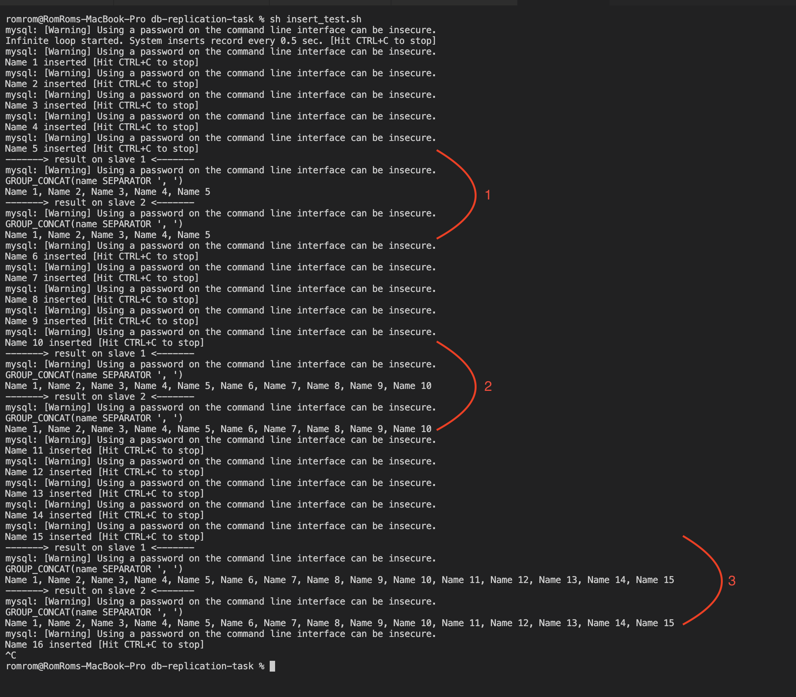
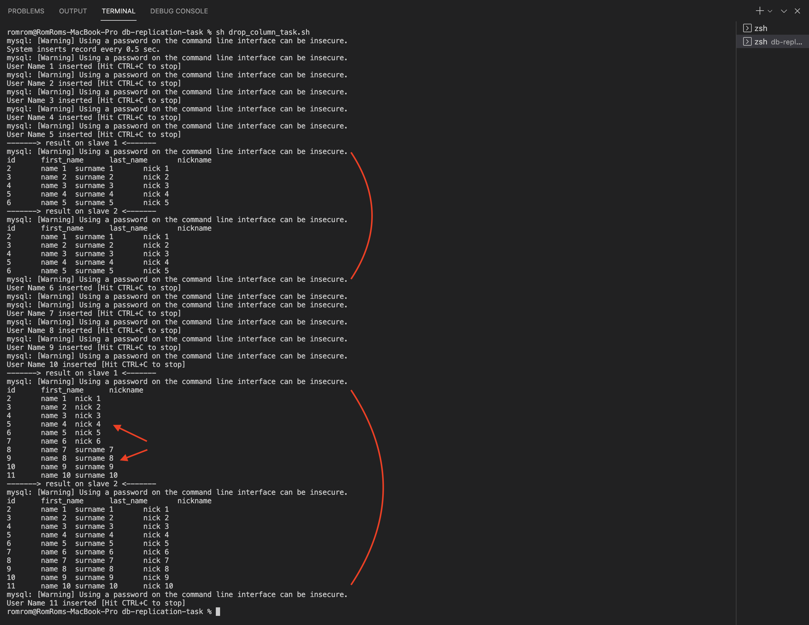
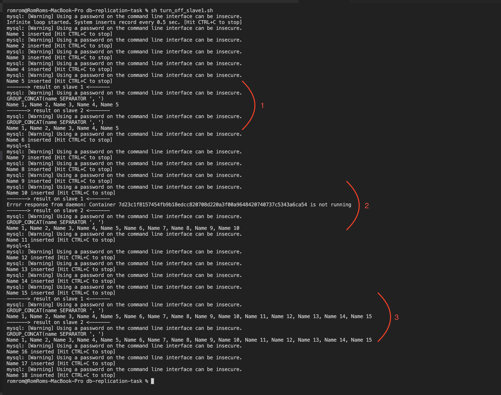

# DB Replication Task

### Pre requisits 

1. installed docker

### Prepare MySQL

1. Start docker-compose via command `docker-compose up`
2. When all containers started -- run init script and follow the instructions: `sh init.sh`

#### Insert task

Insert task can be tested via script: `sh insert_task.sh`

**Result:**

#### Drop column task

Drop column task can be tested via script: `sh drop_column_task.sh`

**Result:**

#### Turn off slave1 task

Turn off slave1 task can be tested via script: `sh turn_off_slave1.sh`

**Result:**

