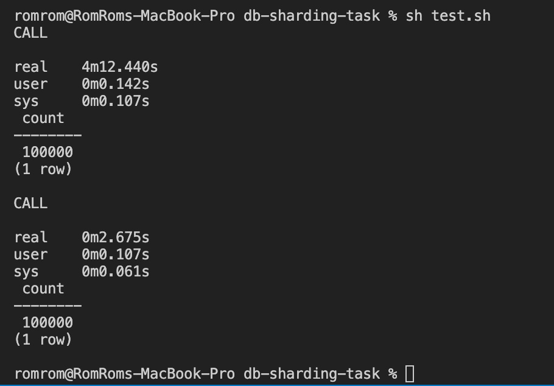
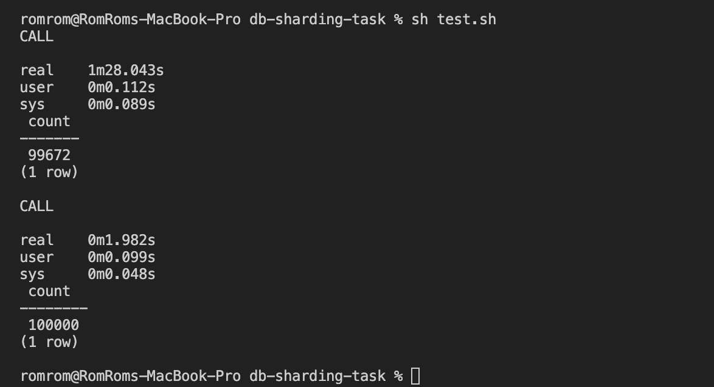

# Start working

### Pre requisits 

1. installed docker

## Test scenario

0. Start docker conainter using: `docker-compose up`
1. Execute the script `init.sh` to configure sharing
2. Run test script to insert 100k records and compare performance: `sh test.sh`

### Results

Stand alone version is much better on 100k records. 



### Problem

Sometimes result is very unpredictible. We could get duplicated records as well
as data lost. 
Seems that problem is in `random()` method that postgres provides. 
I user this method to generate data for insertion and used it twice: 

- for generating year 
- for generating category

Previous example of the query: 

```
insert into books 
values (counter, (case when random() > 0.5 then 2 else 1 end), 
'Author ' || counter, 'Title ' || counter, random_between(1900, 2022));
```

And results:

```
CALL

real    0m0.379s
user    0m0.108s
sys     0m0.054s
 count 
-------
   101
(1 row)

CALL

real    0m0.250s
user    0m0.099s
sys     0m0.052s
 count 
-------
   100
(1 row)
```




For sharded table the insertion logic was changed to next: 

```
category := (counter % 2) + 1;

insert into books 
values (counter, category, 'Author ' || counter, 'Title ' || counter, random_between(1900, 2022));
```

Now it's working fine. Results are provided with this change.