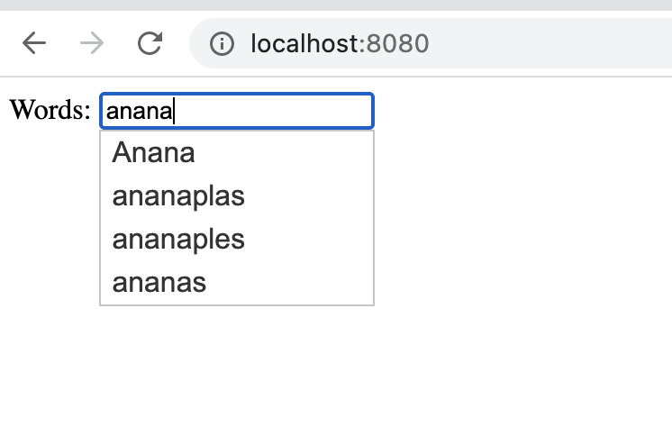
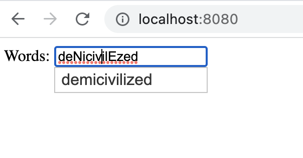

# Start working

### Pre requisits 

1. installed docker

## Test scenario

0. Start docker conainter using: `docker-compose up`
1. Create index and upload data to the elastic using script `init.sh`
2. Open http://localhost:8080/ and have fun :)


### Index config

```
curl -XPUT http://localhost:9200/english-dictionary?pretty=true -H 'Content-Type: application/json' -d '
{
  "settings": {
        "index": {
            "analysis": {
                "analyzer": {
                    "analyzer_startswith": {
                        "tokenizer": "keyword",
                        "filter": "lowercase"
                    }
                }
            }
        }
    },
    "mappings": {
        "properties": {
            "word": {
                "type": "text",
                "analyzer": "analyzer_startswith"
            }
        }
    }
}'
```

### Results

Uppercase letters show the mistake



