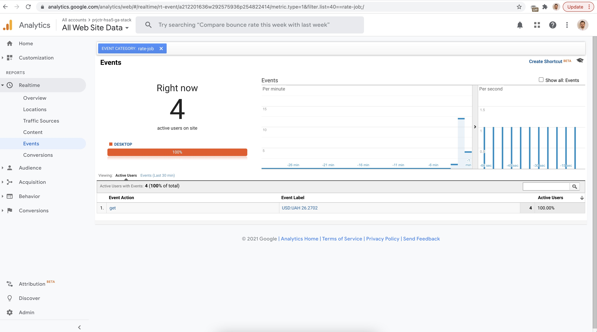

# Start working

### Pre requisits 

1. installed docker
2. (OPTIONAL) installed JDK 17
3. (OPTIONAL) installed maven

## Steps to run with included app.jar 

0. Open CLI and go to the project folder `./ga-stack`
1. You are ready to start:`docker-compose up` (You can change `tracking id` by env variable: `GA_TRACKING_ID`. 
By default all requrest will go to my personal GA site)
2. Enjoy :)

Result:

## Steps to run with building project

> Note that `TRACKING_ID` is empty by default. You can change it in `application.yml` 
> or provide it in `docker-compose` file.

0. Open CLI and go to the project folder. Filrst of all, navigate to greeting project `./ga-stack/currency`
1. Build greeting project first: `mvn clean install` (or `maven clean install`)
2. Then you should build docker image `docker build -t currency-app .`
3. You are ready to start:`docker-compose up`
4. Enjoy :)