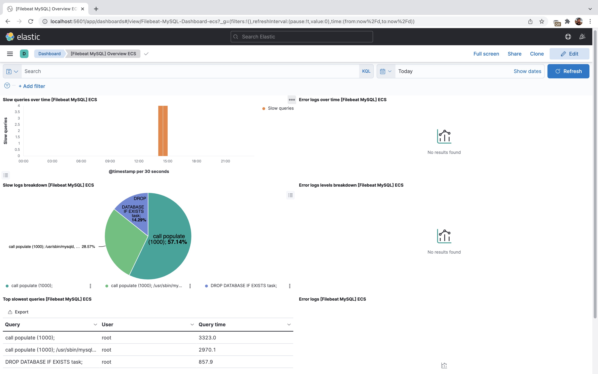
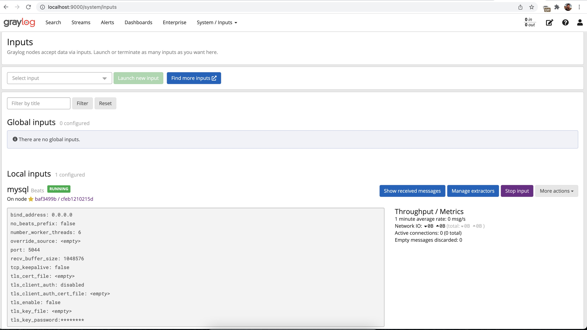
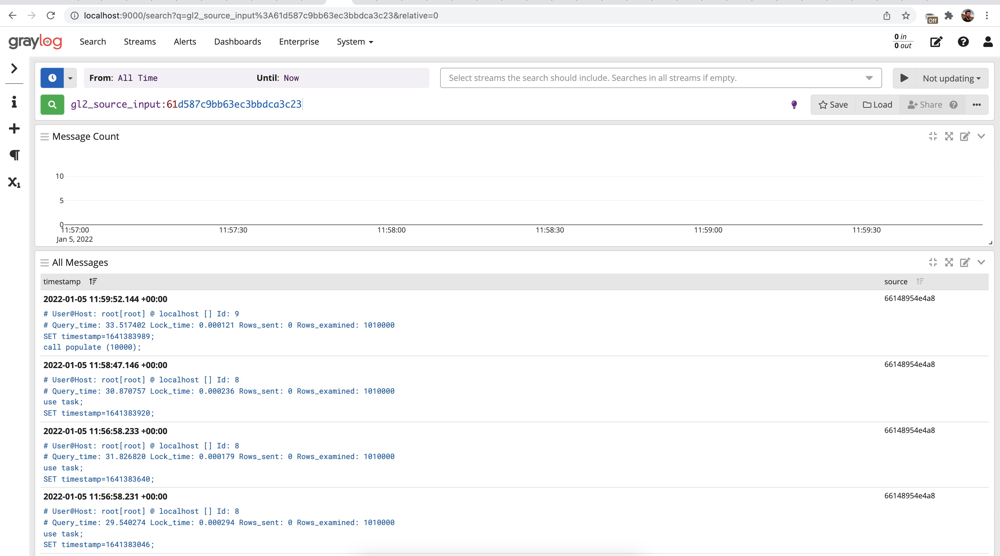

### Pre requisits 

1. installed docker

### MySQL confgis

MySQL configuration is located in `./configs/custom-mysql.cnf` file where slow
query logging was enabled. A script from `test-query` folder can be 
used to generate some logs. 

### Kibana stack

`docker-compose up`

Kibana stack can be started by docker-compose file located in the `kibana-stack`
folder.

As manual step you should create index in kibana and upload sample dashboard 
from Filebeat setup configs. 

Please note, maybe it'll require to restart filebeat in case it didn't connect
to elastic 

#### Result

### Graylog stack

`docker-compose up` (admin/admin)

Graylog stack can be started by docker-compose file located in the `graylog-stack`
folder. 
Before seeing logs you should configure Beats input in graylog. Just give it 
a name and leave all other fields as is.

After this test query can be run via command `./init.sh` (you can find query in
the `test-query`)

#### Result

