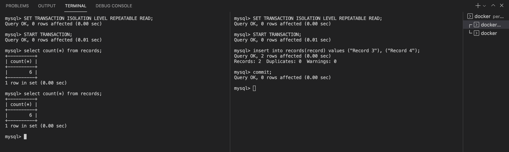

## Percona 

Follow the instructions below to reproduce all problems.

### Pre-requisits

Connect to the docker container via command: `docker exec -it percona bash`
Then connect to DB: `mysql -uroot -p'password'`

Execute the script below for test data:

```sql
SET autocommit = 0;
DROP DATABASE IF EXISTS task;
CREATE DATABASE IF NOT EXISTS task;
USE task;

CREATE TABLE records (
  id int NOT NULL AUTO_INCREMENT,
  record VARCHAR(50) not null,
  PRIMARY KEY (id)
) ENGINE=InnoDB;

insert into records(record)
values ("Record 1"),("Record 2");
COMMIT;
```

### Dirty reads

#### Read Uncommitted

| Transaction 1 | Transaction 2 |
|---|---|
| `SET TRANSACTION ISOLATION LEVEL READ UNCOMMITTED; START TRANSACTION;` | `SET TRANSACTION ISOLATION LEVEL READ UNCOMMITTED; START TRANSACTION;` |
| `select * from records where id = 1;` |  |
| | `update records set record = 'Record 1 UPDATED' where id = 1;` |
| `select * from records where id = 1;` |  |
| | `ROLLBACK;` |
| `select * from records where id = 1;` |  |


#### Read Committed

| Transaction 1 | Transaction 2 |
|---|---|
| `SET TRANSACTION ISOLATION LEVEL READ COMMITTED; START TRANSACTION;` | `SET TRANSACTION ISOLATION LEVEL READ COMMITTED; START TRANSACTION;` |
| `select * from records where id = 1;` |  |
| | `update records set record = 'Record 1 UPDATED' where id = 1;` |
| `select * from records where id = 1;` |  |
| | `ROLLBACK;` |
| `select * from records where id = 1;` |  |


#### Repeatable Read

| Transaction 1 | Transaction 2 |
|---|---|
| `SET TRANSACTION ISOLATION LEVEL REPEATABLE READ; START TRANSACTION;` | `SET TRANSACTION ISOLATION LEVEL REPEATABLE READ; START TRANSACTION;` |
| `select * from records where id = 1;` |  |
| | `update records set record = 'Record 1 UPDATED' where id = 1;` |
| `select * from records where id = 1;` |  |
| | `ROLLBACK;` |
| `select * from records where id = 1;` |  |


#### Serializable

| Transaction 1 | Transaction 2 |
|---|---|
| `SET TRANSACTION ISOLATION LEVEL SERIALIZABLE; START TRANSACTION;` | `SET TRANSACTION ISOLATION LEVEL SERIALIZABLE; START TRANSACTION;` |
| `select * from records where id = 1;` |  |
| | `update records set record = 'Record 1 UPDATED' where id = 1;` |


### Lost updates

#### Read Uncommitted

| Transaction 1 | Transaction 2 |
|---|---|
| `SET TRANSACTION ISOLATION LEVEL READ UNCOMMITTED; START TRANSACTION;` | `SET TRANSACTION ISOLATION LEVEL READ UNCOMMITTED; START TRANSACTION;` |
| `update records set record = 'Record 1 v1' where id = 1;` |  |
|  | `update records set record = 'Record 1 v2' where id = 1;` |


#### Read Committed

| Transaction 1 | Transaction 2 |
|---|---|
| `SET TRANSACTION ISOLATION LEVEL READ COMMITTED; START TRANSACTION;` | `SET TRANSACTION ISOLATION LEVEL READ COMMITTED; START TRANSACTION;` |
| `update records set record = 'Record 1 v1' where id = 1;` |  |
|  | `update records set record = 'Record 1 v2' where id = 1;` |


#### Repeatable Read

| Transaction 1 | Transaction 2 |
|---|---|
| `SET TRANSACTION ISOLATION LEVEL REPEATABLE READ; START TRANSACTION;` | `SET TRANSACTION ISOLATION LEVEL REPEATABLE READ; START TRANSACTION;` |
| `update records set record = 'Record 1 v1' where id = 1;` |  |
|  | `update records set record = 'Record 1 v2' where id = 1;` |


#### Serializable

| Transaction 1 | Transaction 2 |
|---|---|
| `SET TRANSACTION ISOLATION LEVEL SERIALIZABLE; START TRANSACTION;` | `SET TRANSACTION ISOLATION LEVEL SERIALIZABLE; START TRANSACTION;` |
| `update records set record = 'Record 1 v1' where id = 1;` |  |
|  | `update records set record = 'Record 1 v2' where id = 1;` |


### Non-repeatable reads

#### Read Uncommitted

| Transaction 1 | Transaction 2 |
|---|---|
| `SET TRANSACTION ISOLATION LEVEL READ UNCOMMITTED; START TRANSACTION;` | `SET TRANSACTION ISOLATION LEVEL READ UNCOMMITTED; START TRANSACTION;` |
| `select * from records where id = 1;` |  |
| | `update records set record = 'Record 1 UPDATED' where id = 1;` |
| | `COMMIT;` |
| `select * from records where id = 1;` |  |


#### Read Committed

| Transaction 1 | Transaction 2 |
|---|---|
| `SET TRANSACTION ISOLATION LEVEL READ COMMITTED; START TRANSACTION;` | `SET TRANSACTION ISOLATION LEVEL READ COMMITTED; START TRANSACTION;` |
| `select * from records where id = 1;` |  |
| | `update records set record = 'Record 1 UPDATED' where id = 1;` |
| | `COMMIT;` |
| `select * from records where id = 1;` |  |


#### Repeatable Read

| Transaction 1 | Transaction 2 |
|---|---|
| `SET TRANSACTION ISOLATION LEVEL REPEATABLE READ; START TRANSACTION;` | `SET TRANSACTION ISOLATION LEVEL REPEATABLE READ; START TRANSACTION;` |
| `select * from records where id = 1;` |  |
| | `update records set record = 'Record 1 UPDATED' where id = 1;` |
| | `COMMIT;` |
| `select * from records where id = 1;` |  |


#### Serializable

| Transaction 1 | Transaction 2 |
|---|---|
| `SET TRANSACTION ISOLATION LEVEL SERIALIZABLE; START TRANSACTION;` | `SET TRANSACTION ISOLATION LEVEL SERIALIZABLE; START TRANSACTION;` |
| `select * from records where id = 1;` |  |
| | `update records set record = 'Record 1 UPDATED' where id = 1;` |


### Phantom reads

#### Read Uncommitted

| Transaction 1 | Transaction 2 |
|---|---|
| `SET TRANSACTION ISOLATION LEVEL READ UNCOMMITTED; START TRANSACTION;` | `SET TRANSACTION ISOLATION LEVEL READ UNCOMMITTED; START TRANSACTION;` |
| `select count(*) from records;` |  |
| | `insert into records(record) values ('Record 3'), ('Record 4');` |
| | `COMMIT;` |
| `select count(*) from records;` |  |


#### Read Committed

| Transaction 1 | Transaction 2 |
|---|---|
| `SET TRANSACTION ISOLATION LEVEL READ COMMITTED; START TRANSACTION;` | `SET TRANSACTION ISOLATION LEVEL READ COMMITTED; START TRANSACTION;` |
| `select count(*) from records;` |  |
| | `insert into records(record) values ('Record 3'), ('Record 4');` |
| | `COMMIT;` |
| `select count(*) from records;` |  |


#### Repeatable Read

| Transaction 1 | Transaction 2 |
|---|---|
| `SET TRANSACTION ISOLATION LEVEL REPEATABLE READ; START TRANSACTION;` | `SET TRANSACTION ISOLATION LEVEL REPEATABLE READ; START TRANSACTION;` |
| `select count(*) from records;` |  |
| | `insert into records(record) values ('Record 3'), ('Record 4');` |
| | `COMMIT;` |
| `select count(*) from records;` |  |



**Attempt 2**

| Transaction 1 | Transaction 2 |
|---|---|
| `SET TRANSACTION ISOLATION LEVEL REPEATABLE READ; START TRANSACTION;` | `SET TRANSACTION ISOLATION LEVEL REPEATABLE READ; START TRANSACTION;` |
| `select * from records;` |  |
| | `insert into records(record) values ('Record 3'), ('Record 4');` |
| | `COMMIT;` |
| `select * from records;` |  |
| `update records set record = 'Record 3 NEW!!!' where id = 3;` |  |
| `select * from records;` |  |


#### Serializable

| Transaction 1 | Transaction 2 |
|---|---|
| `SET TRANSACTION ISOLATION LEVEL SERIALIZABLE; START TRANSACTION;` | `SET TRANSACTION ISOLATION LEVEL SERIALIZABLE; START TRANSACTION;` |
| `select count(*) from records;` |  |
| | `insert into records(record) values ('Record 3'), ('Record 4');` |


### Results

|  | Dirty reads | Lost updates | Non-repeatable reads | Phantom reads |
|---|---|---|---|---|
| **Read Uncommitted**  | possible | not possible | possible | possible |
| **Read Committed**    | not possible | not possible | possible | possible |
| **Repeatable Read**   | not possible | not possible | not possible | ~~not possible~~ possible |
| **Serializable**      | not possible | not possible | not possible | not possible |
