## PostgreSQL 

Follow the instructions below to reproduce all problems.

> Please note that **READ UNCOMMITTED** is not supported in postgres. 
> Postgres treats it as **READ COMMITTED**. ([doc](https://www.postgresql.org/docs/current/sql-set-transaction.html#:~:text=The%20SQL%20standard%20defines%20one%20additional%20level%2C%20READ%20UNCOMMITTED.%20In%20PostgreSQL%20READ%20UNCOMMITTED%20is%20treated%20as%20READ%20COMMITTED.))

### Pre-requisits

Connect to the docker container via command: `docker exec -it postgres bash`
Then connect to DB: `psql -U postgres`


```sql
DROP DATABASE task;
CREATE DATABASE task;

\c task;

CREATE TABLE records (
	id serial PRIMARY KEY,
	record VARCHAR NOT NULL
);
insert into records(record)
values ('Record 1'),('Record 2');
COMMIT;
```


### Dirty reads

#### Read Committed

| Transaction 1 | Transaction 2 |
|---|---|
| `BEGIN TRANSACTION ISOLATION LEVEL READ COMMITTED;` | `BEGIN TRANSACTION ISOLATION LEVEL READ COMMITTED;` |
| `select * from records where id = 1;` |  |
| | `update records set record = 'Record 1 UPDATED' where id = 1;` |
| `select * from records where id = 1;` |  |
| | `ROLLBACK;` |
| `select * from records where id = 1;` |  |

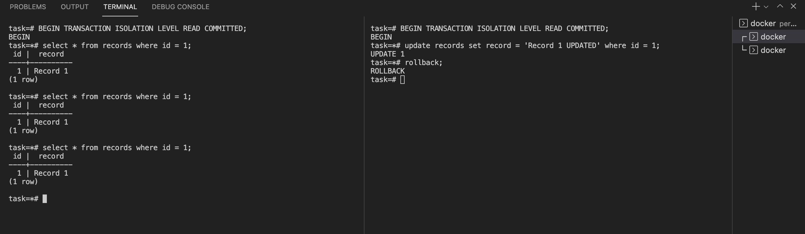


#### Repeatable Read

| Transaction 1 | Transaction 2 |
|---|---|
| `BEGIN TRANSACTION ISOLATION LEVEL REPEATABLE READ;` | `BEGIN TRANSACTION ISOLATION LEVEL REPEATABLE READ;` |
| `select * from records where id = 1;` |  |
| | `update records set record = 'Record 1 UPDATED' where id = 1;` |
| `select * from records where id = 1;` |  |
| | `ROLLBACK;` |
| `select * from records where id = 1;` |  |

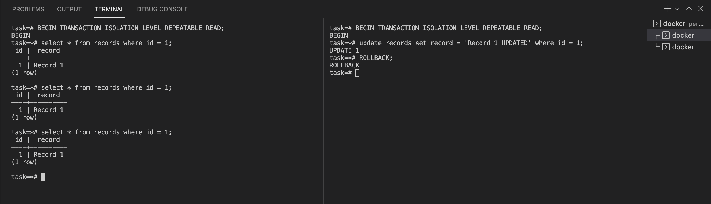


#### Serializable

| Transaction 1 | Transaction 2 |
|---|---|
| `BEGIN TRANSACTION ISOLATION LEVEL SERIALIZABLE;` | `BEGIN TRANSACTION ISOLATION LEVEL SERIALIZABLE;` |
| `select * from records where id = 1;` |  |
| | `update records set record = 'Record 1 UPDATED' where id = 1;` |
| `select * from records where id = 1;` |  |
| | `ROLLBACK;` |
| `select * from records where id = 1;` |  |

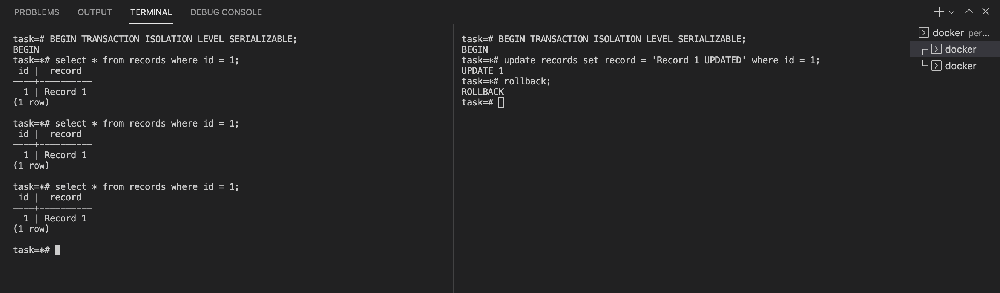


### Lost updates

#### Read Committed

| Transaction 1 | Transaction 2 |
|---|---|
| `BEGIN TRANSACTION ISOLATION LEVEL READ COMMITTED;` | `BEGIN TRANSACTION ISOLATION LEVEL READ COMMITTED;` |
| `update records set record = 'Record 1 v1' where id = 1;` |  |
|  | `update records set record = 'Record 1 v2' where id = 1;` |

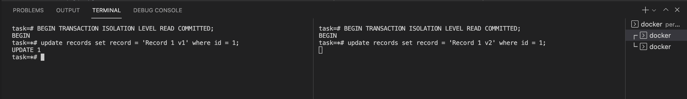


#### Repeatable Read

| Transaction 1 | Transaction 2 |
|---|---|
| `BEGIN TRANSACTION ISOLATION LEVEL REPEATABLE READ;` | `BEGIN TRANSACTION ISOLATION LEVEL REPEATABLE READ;` |
| `update records set record = 'Record 1 v1' where id = 1;` |  |
|  | `update records set record = 'Record 1 v2' where id = 1;` |

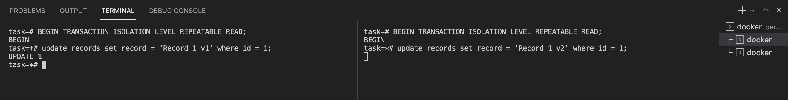


#### Serializable

| Transaction 1 | Transaction 2 |
|---|---|
| `BEGIN TRANSACTION ISOLATION LEVEL SERIALIZABLE;` | `BEGIN TRANSACTION ISOLATION LEVEL SERIALIZABLE;` |
| `update records set record = 'Record 1 v1' where id = 1;` |  |
|  | `update records set record = 'Record 1 v2' where id = 1;` |

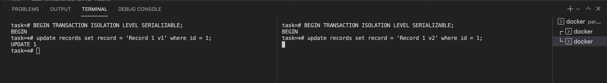


### Non-repeatable reads

#### Read Committed

| Transaction 1 | Transaction 2 |
|---|---|
| `BEGIN TRANSACTION ISOLATION LEVEL READ COMMITTED;` | `BEGIN TRANSACTION ISOLATION LEVEL READ COMMITTED;` |
| `select * from records where id = 1;` |  |
| | `update records set record = 'Record 1 UPDATED' where id = 1;` |
| | `COMMIT;` |
| `select * from records where id = 1;` |  |

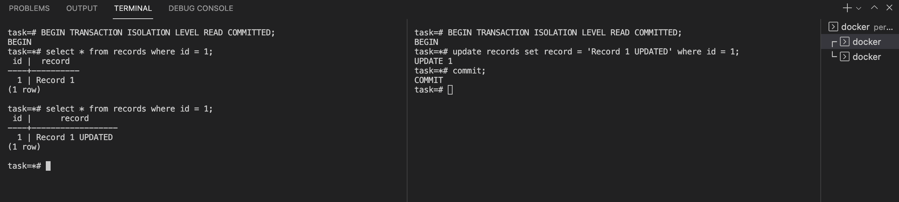


#### Repeatable Read

| Transaction 1 | Transaction 2 |
|---|---|
| `BEGIN TRANSACTION ISOLATION LEVEL REPEATABLE READ;` | `BEGIN TRANSACTION ISOLATION LEVEL REPEATABLE READ;` |
| `select * from records where id = 1;` |  |
| | `update records set record = 'Record 1 UPDATED' where id = 1;` |
| | `COMMIT;` |
| `select * from records where id = 1;` |  |

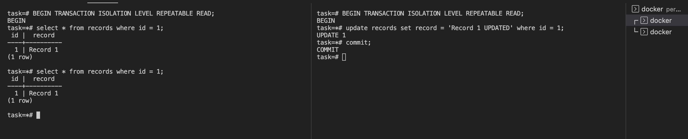


#### Serializable

| Transaction 1 | Transaction 2 |
|---|---|
| `BEGIN TRANSACTION ISOLATION LEVEL SERIALIZABLE;` | `BEGIN TRANSACTION ISOLATION LEVEL SERIALIZABLE;` |
| `select * from records where id = 1;` |  |
| | `update records set record = 'Record 1 UPDATED' where id = 1;` |
| | `COMMIT;` |
| `select * from records where id = 1;` |  |

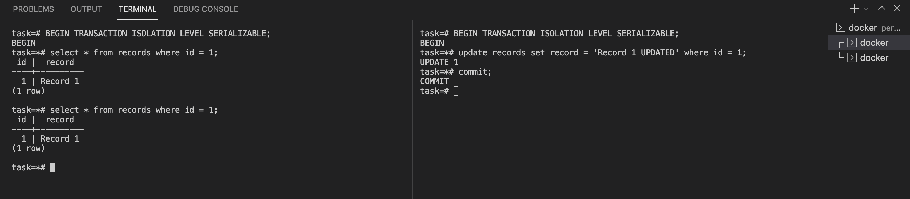


### Phantom reads

#### Read Committed

| Transaction 1 | Transaction 2 |
|---|---|
| `BEGIN TRANSACTION ISOLATION LEVEL READ COMMITTED;` | `BEGIN TRANSACTION ISOLATION LEVEL READ COMMITTED;` |
| `select count(*) from records;` |  |
| | `insert into records(record) values ('Record 3'), ('Record 4');` |
| | `COMMIT;` |
| `select count(*) from records;` |  |

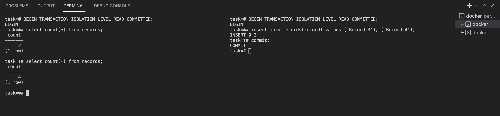


#### Repeatable Read

| Transaction 1 | Transaction 2 |
|---|---|
| `BEGIN TRANSACTION ISOLATION LEVEL REPEATABLE READ;` | `BEGIN TRANSACTION ISOLATION LEVEL REPEATABLE READ;` |
| `select count(*) from records;` |  |
| | `insert into records(record) values ('Record 3'), ('Record 4');` |
| | `COMMIT;` |
| `select count(*) from records;` |  |

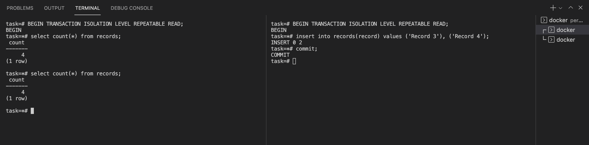


#### Serializable

| Transaction 1 | Transaction 2 |
|---|---|
| `BEGIN TRANSACTION ISOLATION LEVEL SERIALIZABLE;` | `BEGIN TRANSACTION ISOLATION LEVEL SERIALIZABLE;` |
| `select count(*) from records;` |  |
| | `insert into records(record) values ('Record 3'), ('Record 4');` |
| | `COMMIT;` |
| `select count(*) from records;` |  |

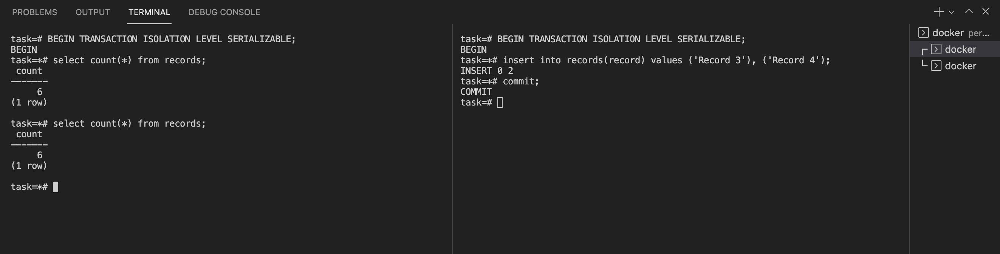


### Results

|  | Dirty reads | Lost updates | Non-repeatable reads | Phantom reads |
|---|---|---|---|---|
| **Read Committed**    | not possible | not possible | possible | possible |
| **Repeatable Read**   | not possible | not possible | not possible | not possible |
| **Serializable**      | not possible | not possible | not possible | not possible |

