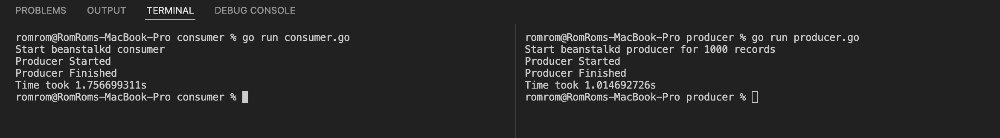

### Pre requisits 

1. installed docker
2. installed golang

## Benchmark Results

There several scripts to test both tools. They are placed in `./app` folder.

Steps to test

1. Open two terminals and navigate to appropriate producer/consumer folders
2. Run producer script via `go run producer.go`
3. Run consumer script via `go run consumer.go`

### Beanstalkd

P.S. We can reduce the consumer time via removing 'Delete key from queue' logic on each step.
In this case results are better

### Redis AOF

### Redis RDB

## Conclusion

**Beanstalkd** is a better queue than **Redis** in the simple application.

**Redis RDB** mode is better for heavy writing but could lead to data lost. 

For more complex apps additional testing required.
