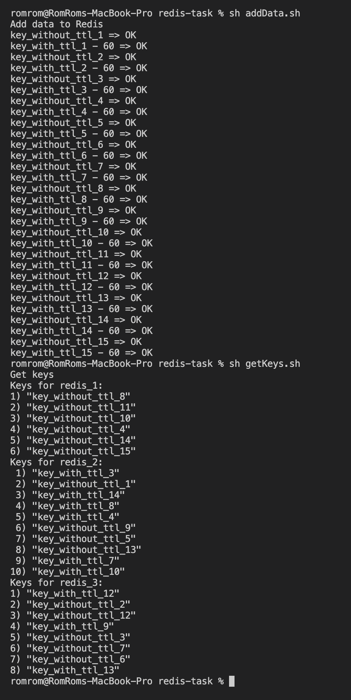
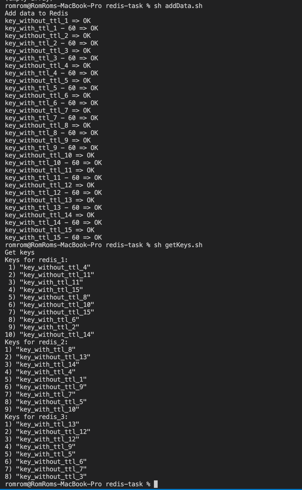
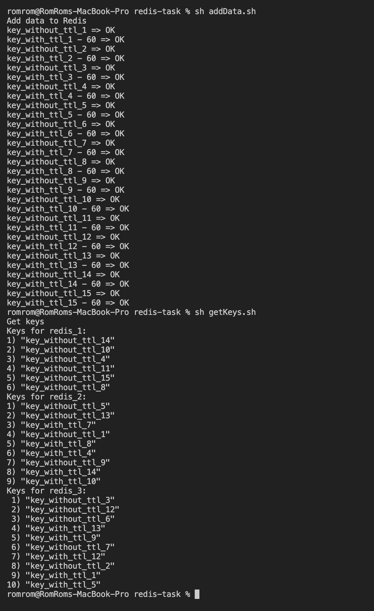
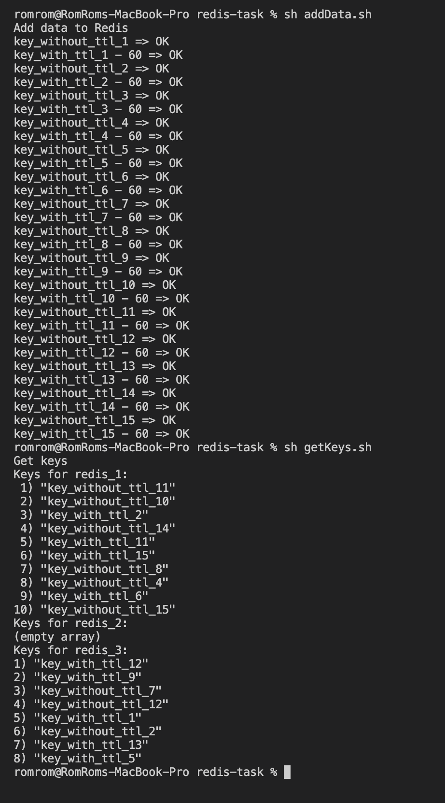
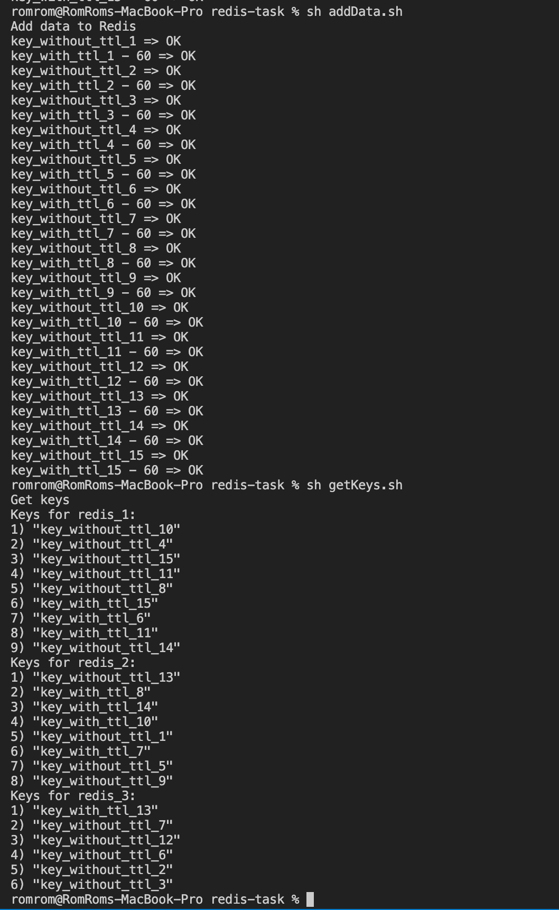
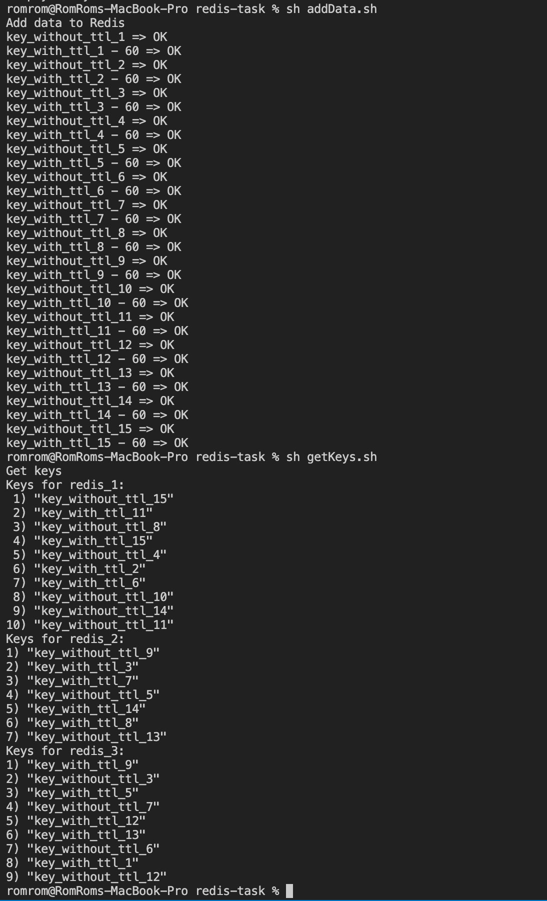
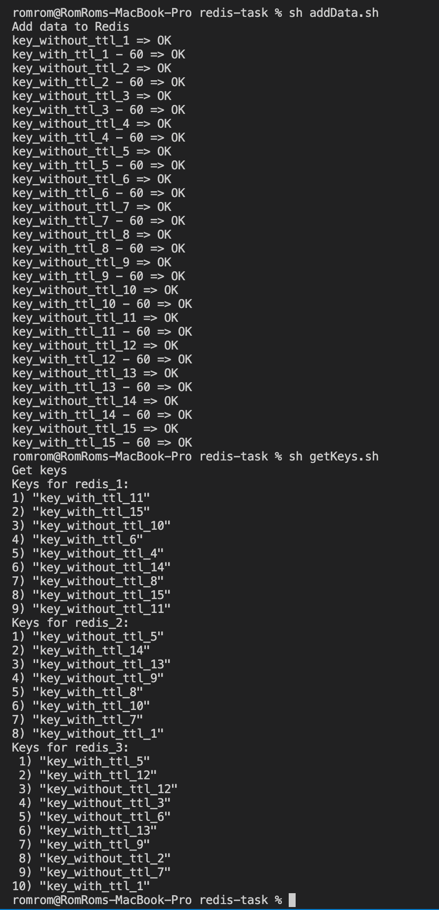
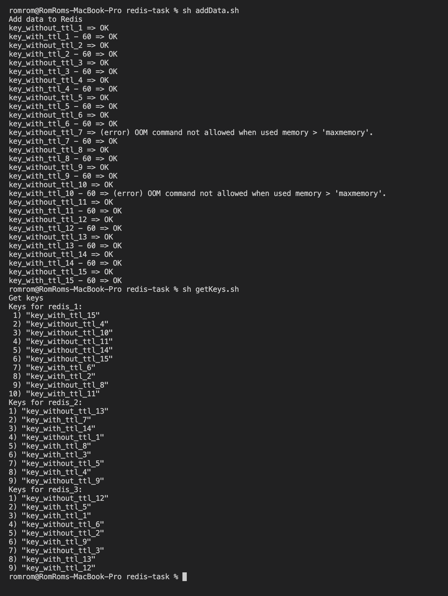

### Pre requisits 

1. installed docker

## Redis cluster

Redis cluster is created accoring to the [tutorial](https://redis.io/topics/cluster-tutorial)

**Steps to start cluster:**

0. Run `docker-compose up`
1. When all containers are up -- run `init.sh` script to build a cluster

## Eviction strategies

All the strategies are working as expected. Description can be found 
[here](https://docs.redis.com/latest/rs/concepts/memory-performance/eviction-policy/)

**Steps to test strategy:**

0. Select eviction strategy you wanna test in the `redis-cluster.conf` file
1. Start redis cluster
2. Use script `addData.sh` to generate random data
3. Use `getKeys.sh` script to get keys from the cluster.
4. Compare expectation to result based on strategy description. 

### Strategy volatile-lru

### Strategy allkeys-lru

### Strategy volatile-lfu

### Strategy allkeys-lfu

### Strategy volatile-random

### Strategy allkeys-random

### Strategy volatile-ttl

### Strategy noeviction 

## Cache stampede

This part is already done in [homework #4](https://github.com/raxyz/prjctr-hsa5/tree/main/stress-test-stack)