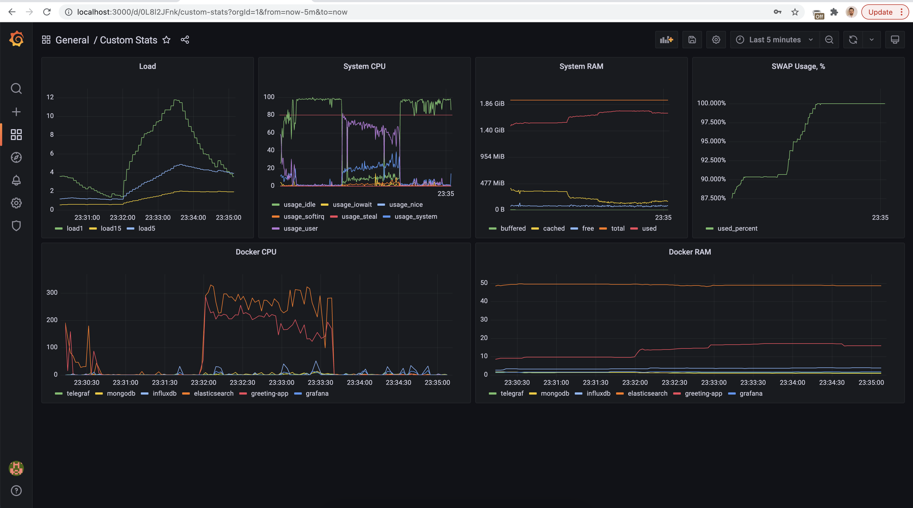

# Start working

### Pre requisits 

1. installed docker
2. installed apache bench (om macos it's installed by default)
3. (OPTIONAL) installed JDK 17
4. (OPTIONAL) installed maven

## Steps to run with included app.jar

0. Open CLI and go to the project folder `./tig-stack`
1. Execute this command: `sudo chown $USER /var/run/docker.sock` (allow telegraf to work with docker.sock)
2. You are ready to start:`docker-compose up` (it is fine if greeting app failed to start first time. It has 'restart' 
flag and will start on 2-3 time)
3. When all services are up -- upload default configs (grafana dashboard, datasource and init data) by running `./run.sh`
4. open grafana: [http://localhost:3000/](http://localhost:3000/) (admin/admin) => Dashboards => Manage => select "Custom Stats" dashboard => Switch 
interval to 15 mins for better view.
5. run ab test for details: `ab -n 5000 -c 500 -g ab_out.txt http://localhost:8080/api/v1/users`
6. Enjoy :)

### Result

## Steps to run with building project

0. Open CLI and go to the project folder. Filrst of all, navigate to greeting project `./tig-stack/greeting`
1. Build greeting project first: `mvn clean install -DskipTests` (or `maven clean install -DskipTests`)
2. Then you should build docker image `docker build -t greeting-app .`
3. Go back to the tig-stack folder (`cd ../`) and execute this command: `sudo chown $USER /var/run/docker.sock` 
(allow telegraf to work with docker.sock)
4. You are ready to start:`docker-compose up` (it is fine if greeting app failed to start first time. It has 'restart' 
flag and will start on 2-3 time)
5. When all services are up -- upload default configs (grafana dashboard, datasource and init data) by running `./run.sh`
6. open grafana: [http://localhost:3000/](http://localhost:3000/) (admin/admin) => Dashboards => Manage => select "Custom Stats" dashboard => Switch 
interval to 15 mins for better view.
7. run ab test for details: `ab -n 5000 -c 500 -g ab_out.txt http://localhost:8080/api/v1/users`
8. Enjoy :)
